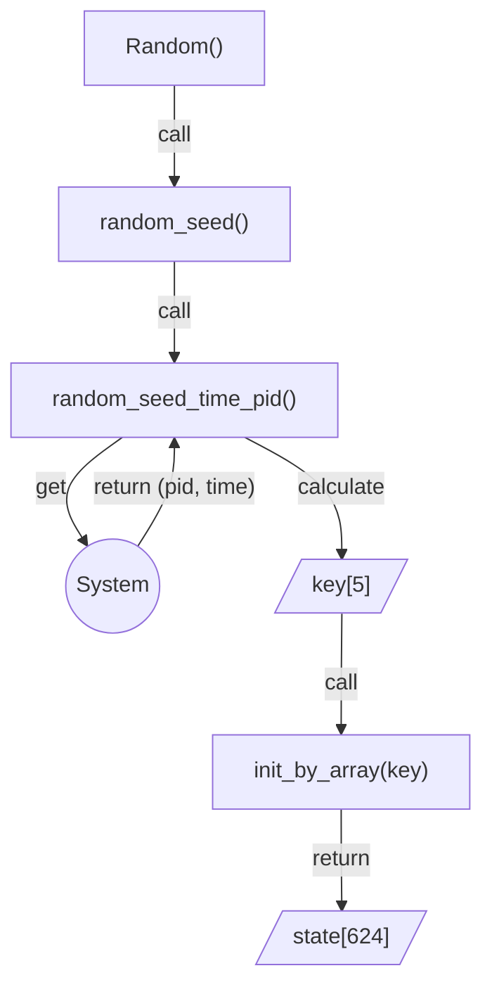

# BKCTF 2023 - Cryptography Writeups

Đây là Writeups của giải CTF được tổ chức bởi Đại Học Bách khoa Hà Nội vào 20/8. Lời nói đầu thì mình thấy đây là giải ở Việt Nam từ hồi TetCTF 2023 đầu năm tới giờ mà mình ưng phần cryptography nhất (không guessy, không quá khó, không quá nhiều), nói chung là đọc đề là có hướng ngay chứ cũng không bị lan man :100: .

## DH

[source](https://github.com/m1dm4n/CTF-WriteUp/blob/main/2023/bksecctf/bkctf2023-dh)

- $n$ được tạo thành từ 2 số nguyên tố smooth => Dùng thuật toán [**p-1** của Pollard](https://en.wikipedia.org/wiki/Pollard%27s_p_%E2%88%92_1_algorithm) để factor thành các thừa số nguyên tố

```python
def polard(n: int, cap):
    g = mpz(3)
    cur = mpz(2)
    # pbar = tqdm(total=int(cap))
    # pbar.update(int(cur))
    while cur < cap:
        g = powmod(g, cur**10, n)
        if g == 1:
            break
        check = gcd(g - 1, n)
        if check != 1:
            return int(check)
        nx = next_prime(cur)
        # delta = nx - cur
        # pbar.update(int(delta))
        cur = nx
        # pbar.close()
    return None

p = polard(n, 2**12)
q = int(iroot(n//p**11, 11)[0])
print(f"{p = }")
print(f"{q = }")
```

- Tiếp theo ta cần giải bài toán logarit rời rạc:

$$
3^x = A \pmod{n},\ \ x \in [0, n)
$$

- Để ý $n$ có dạng đặc biệt là $p^{11}*q^{11}$, ngoài ra để dễ dàng tính dlog của $A$ ta sẽ tính dlog trên 2 trường con $p^{11}$ và $q^{11}$.

- Đây là các trường đặc biệt hay nói cách khác là bài toán  logarithm rời rạc trên các số p-adic là rất dễ dàng: [Tham khảo](https://blog.kelte.cc/ctf/writeup/2021/05/15/m0lecon-ctf-2021-teaser-giant-log.html)

```python
# Solving dlog on p-adic field
Rp = Zp(p, 11)
Rq = Zp(q, 11)
ap = (Rp(A).log() / Rp(3).log()).lift()
aq = (Rq(A).log() / Rq(3).log()).lift()
```

- Tuy nhiên $\lambda(p^{11}) = (p-1)p^{10}$, $\lambda(q) = (q-1)q^{10}$ nên $\lambda(n) = (p-1)(q-1)(p*q)^{10}$  mà để tính dlog cho các số p-adic trên $F_{p^{11}}$ chỉ trả về 1 số nằm trong trường con $p^{10} \in \lambda(p^{11})$ trên $F_{p^{11}}$, tương tự với $q$. Do đó ta cần tính thêm dlog trên 2 trường con $p-1$ và $q-1$, sau đó dùng định lý số dư Trung hoa để khôi phục lại $a$

- Vì mình đang cần tìm dlog trên subgroup $(p-1) \in \lambda(p^{11})$ nên cần phải mũ $p^{10}$ cho 2 số  để đưa về cùng subgroup ($o(3) = (p-1)p^{10} => o(3^{p^{10}})=(p-1)$), tương tự với $p-1$
```python
odp = p-1
R = Zmod(p**11)
a_mod_odp = discrete_log(R(A) ** (p**10), R(3) ** (p**10), ord=ZZ(odp))
odq = q-1
R = Zmod(q**11)
a_mod_odq = discrete_log(R(A) ** (q**10), R(3) ** (q**10), ord=ZZ(odq))
a = int(crt([ap, aq, a_mod_odp, a_mod_odq], [p**10, q**10, odp, odq]))
assert pow(3, a, n) == A
```

- Tới đây thì tính `key` và giải mã `flag` thôi:


[Full script](https://github.com/m1dm4n/CTF-WriteUp/blob/main/2023/bksecctf/bkctf2023-dh/solve.py)

## Pub Block

[source](https://github.com/m1dm4n/CTF-WriteUp/blob/main/2023/bksecctf/bkctf2023-pub_block)

- Phân tích hàm `encrypt`, ta sẽ thấy mối quan hệ toán học của `leak` và các block trong `enc`:

$$
enc_{i} = (leak_{i} * p \mod g) \oplus p \\
=> enc_{i} = (leak_{i} * p \mod g) + error_i \\
=> enc_{i} - leak_{i} * p + k_i*g = error_i
$$

- Với việc $enc_{i}, leak_{i}, g$ là các giá trị cho trước, thì đây là 1 bài toán Hidden Number điển hình và ta sẽ dùng LLL để giải. Ta dựng Lattice như sau:

$$
\begin{pmatrix}
g &  &  & & &  \\
 & g & & &  &  \\
 & & \ddots &  & & \\
 & & & g & &  \\
-leak_0 & -leak_1 & \dots & -leak_{l} & 1 &  \\
enc_0 & enc_1 & \dots & enc_{l} &  & 2^{256} \\
\end{pmatrix}
$$

=> Vector bé nhất trong Lattice sẽ là: $(error_0,\ error_1,\ \dots \ ,\ error_{l},\ p,\ 2^{256})$

- $l$ sẽ là số lượng phương trình mà ta muốn dùng, có 1 công thức giúp ta có thể tính $l$ (Chương 4 trong paper: [ref](https://eprint.iacr.org/2019/023.pdf)), điều kiện để giải được **HNP**:

$$
\log_2(B) \leq \bigg \lfloor \frac {\log_2(p)\cdot(l-1)} {l} - \frac {\log_2(l)} {2} \bigg \rfloor
$$

- Với $B$ là upper bound của $error_i$ và $p$ sẽ là modulus ( $g$ ), ta chỉ cần 2 phương trình trở lên là đủ để khôi phục lại $p$

```python
# Construct lattice
l = 3
encs = [int(enc[128*i: 128*(i+1)], 16) for i in range(len(leak))]
mat = matrix(ZZ, l+2, l+2)
for i in range(l):
    mat[i, i] = g
    mat[-2, i] = -leak[i]
    mat[-1, i] = encs[i]
mat[-2, -2] = 1
mat[-1, -1] = 1

# reduce lattice 
target_vector = [2**256]*l + [2**256, 1]
bound_mat = matrix.diagonal([2**256//i for i in target_vector])
mat *= bound_mat
matL = mat.LLL()
matL /= bound_mat
p = matL[0][-2] # usually will be the smallest vector
q = n//p
assert p*q == n
```

- Làm ngược lại hàm decrypt là ta sẽ có `flag`:

```
The "Hidden Number problem" is a cryptographic problem that is closely related to the difficulty of solving certain mathematical equations involving modular arithmetic.

In its simplest form, the Hidden Number problem can be described as follows: Given two integers, (a) and (b), and a modulus (N), find an integer (x) such that (a^x \equiv b \mod N).

The difficulty of the Hidden Number problem lies in the fact that finding the value of (x) directly from the equation is computationally hard, especially when the modulus (N) is large and the values of (a) and (b) are randomly chosen. In fact, the problem is believed to be computationally infeasible to solve efficiently using classical computers for sufficiently large values of (N).

By the way, here is the FLAG: BKSEC{HNP_LLL_CVP_4nd_50_0n_19082023}

The Hidden Number problem has important implications in cryptography, particularly in the field of public-key cryptography. For example, some cryptographic algorithms, such as the Diffie-Hellman key exchange and certain elliptic curve cryptography schemes, rely on the presumed hardness of the Hidden Number problem for their security.

By leveraging the difficulty of solving the Hidden Number problem, these cryptographic schemes can provide secure communication and encryption mechanisms. Essentially, an attacker would need to solve the Hidden Number problem to break the cryptographic system and recover sensitive information, such as private keys or secret messages.

It's worth noting that the security of these cryptographic schemes relies on the assumption that the Hidden Number problem is indeed hard to solve. If a more efficient algorithm or method to solve the problem is discovered in the future, it could have significant implications for the security of these cryptographic systems.
```

> || Đoạn text đọc hơi cấn nha :v ||

## It's time

[source](https://github.com/m1dm4n/CTF-WriteUp/tree/main/2023/bksecctf/bkctf2023-itstime)

### Phân tích

Source không quá dài nên ta có thể nắm bắt được một số đặc điểm của challenge dễ dàng:

- Đầu tiên là server sử dung **libfaketime** với khoảng thời gian được random từ `faketime.py` (Khá lớn để bruteforce)

- Để lấy được flag thì ta cần phải dự đoán đúng (ít nhất là tới xấp xỉ giờ) để có thể tìm được seed mà giải mà flag vì thời gian lấy tới microsecond ($10^{-6}$)

- Với cả 2 điều kiện trên việc bruteforce thẳng seed mà không có thông tin là quá lâu trong 1 giải CTF 8 tiếng. Đây là lúc có thể khẳng định chức năng `1. Get encrypted datas.` sẽ là mục tiêu hàng đầu để exploit

- Chức năng `1. Get encrypted datas.` sẽ cho chúng ta biết vô hạn dữ liệu đầu ra của module `random` => Khôi phục được state ban đầu ngay khi khởi tạo object `Random`

- Ngoài ra có 1 đoạn code rất quan trọng ngay đầu file [server.py](https://github.com/m1dm4n/CTF-WriteUp/blob/main/2023/bksecctf/bkctf2023-itstime/server.py#L4C1-L8C1), tí mình sẽ nói tại sao.

### Đi đào source 

Việc khởi tạo object `Random` mặc định ko có tham số thì đoạn call lên object sẽ được truyền `None`. `_random.pyi`:

```python
from typing_extensions import TypeAlias

# Actually Tuple[(int,) * 625]
_State: TypeAlias = tuple[int, ...]

class Random:
    def __init__(self, seed: object = ...) -> None: ...
    def seed(self, __n: object = None) -> None: ...
    def getstate(self) -> _State: ...
    def setstate(self, __state: _State) -> None: ...
    def random(self) -> float: ...
    def getrandbits(self, __k: int) -> int: ...

```

Tới đây sẽ không còn code để đọc do đó ta sẽ lên github tìm và xem các bước tiếp theo và đây là code mình tìm được: [_randommodule.c](https://github.com/python/cpython/blob/main/Modules/_randommodule.c)

Đây là hàm `seed` sẽ được call tiếp theo: [_randommodule.c#L283](https://github.com/python/cpython/blob/main/Modules/_randommodule.c#L283). Với `arg` là `None` thì đây là điều xảy ra bên trong hàm:

```c
    if (arg == NULL || arg == Py_None) {
       if (random_seed_urandom(self) < 0) {
            PyErr_Clear();

            /* Reading system entropy failed, fall back on the worst entropy:
               use the current time and process identifier. */
            random_seed_time_pid(self);
        }
        return 0;
    }
```

Như vậy `random_seed_urandom` sẽ được gọi để khởi tạo `state` trước, nếu lỗi thì sẽ gọi hàm `random_seed_time_pid` để thay thế khởi tạo. Tiếp tục trace `random_seed_urandom` thì mình thấy đoạn [này](https://github.com/python/cpython/blob/main/Python/bootstrap_hash.c#L473C1-L516C2):

```c
static int
pyurandom(void *buffer, Py_ssize_t size, int blocking, int raise)
{
#if defined(PY_GETRANDOM) || defined(PY_GETENTROPY)
    int res;
#endif

    if (size < 0) {
        if (raise) {
            PyErr_Format(PyExc_ValueError,
                         "negative argument not allowed");
        }
        return -1;
    }

    if (size == 0) {
        return 0;
    }

#ifdef MS_WINDOWS
    return win32_urandom((unsigned char *)buffer, size, raise);
#else

#if defined(PY_GETRANDOM) || defined(PY_GETENTROPY)
    if (HAVE_GETENTRYPY_GETRANDOM_RUNTIME) {
#ifdef PY_GETRANDOM
        res = py_getrandom(buffer, size, blocking, raise);
#else
        res = py_getentropy(buffer, size, raise);
#endif
        if (res < 0) {
            return -1;
        }
        if (res == 1) {
            return 0;
        }
        /* getrandom() or getentropy() function is not available: failed with
           ENOSYS or EPERM. Fall back on reading from /dev/urandom. */
        } /* end of availability block */
#endif

    return dev_urandom(buffer, size, raise);
#endif
}
```

Đây là lý do tại sao lại có đoạn code mà mình nói quan trọng lúc đầu. Đoạn code lúc đầu sẽ gây xảy ra lỗi ngay khi có bất kỳ syscall `getrandom` nào, do đó hàm `random_seed_urandom` sẽ luôn luôn xày ra lỗi và hàm `random_seed_time_pid` sẽ luôn là hàm được sử dụng để khởi tạo thay thế

Code của hàm `random_seed_time_pid` [_randommodule.c#L257](https://github.com/python/cpython/blob/main/Modules/_randommodule.c#L257C1-L280C2):

```c
    _PyTime_t now;
    uint32_t key[5];

    now = _PyTime_GetSystemClock();
    key[0] = (uint32_t)(now & 0xffffffffU);
    key[1] = (uint32_t)(now >> 32);

#if defined(MS_WINDOWS) && !defined(MS_WINDOWS_DESKTOP) && !defined(MS_WINDOWS_SYSTEM)
    key[2] = (uint32_t)GetCurrentProcessId();
#elif defined(HAVE_GETPID)
    key[2] = (uint32_t)getpid();
#else
    key[2] = 0;
#endif

    now = _PyTime_GetMonotonicClock();
    key[3] = (uint32_t)(now & 0xffffffffU);
    key[4] = (uint32_t)(now >> 32);

    init_by_array(self, key, Py_ARRAY_LENGTH(key));
```

Code của hàm `init_by_array` [_randommodule.c#L213](https://github.com/python/cpython/blob/main/Modules/_randommodule.c#L213C1-L238C2):

```c
static void
init_by_array(RandomObject *self, uint32_t init_key[], size_t key_length)
{
    size_t i, j, k;       /* was signed in the original code. RDH 12/16/2002 */
    uint32_t *mt;

    mt = self->state;
    init_genrand(self, 19650218U);
    i=1; j=0;
    k = (N>key_length ? N : key_length);
    for (; k; k--) {
        mt[i] = (mt[i] ^ ((mt[i-1] ^ (mt[i-1] >> 30)) * 1664525U))
                 + init_key[j] + (uint32_t)j; /* non linear */
        i++; j++;
        if (i>=N) { mt[0] = mt[N-1]; i=1; }
        if (j>=key_length) j=0;
    }
    for (k=N-1; k; k--) {
        mt[i] = (mt[i] ^ ((mt[i-1] ^ (mt[i-1] >> 30)) * 1566083941U))
                 - (uint32_t)i; /* non linear */
        i++;
        if (i>=N) { mt[0] = mt[N-1]; i=1; }
    }

    mt[0] = 0x80000000U; /* MSB is 1; assuring non-zero initial array */
}
```

=> Để có thể giải mã flag, ta cần phải khôi phục lại mảng `key` được dùng để khởi tạo cho object

### Sắp xếp mọi thứ lại

Tóm lại toàn bộ quá trình khởi tạo state sẽ là như này:



Với việc module random trong python sử dụng thuật toán [MT19937](https://en.wikipedia.org/wiki/Mersenne_Twister), cái được biết tới không an toàn, thì ta hoàn toàn khôi phục được lại được `state` nếu chúng ta có đủ 634 output được random ra (mỗi output 32 bits). 

Đầu tiên thì mình sẽ kết nối lên server và lấy đủ số lượng output cần thiết. Tối ưu nhất sẽ là lấy flag đã bị mã hoá rồi hãy lấy output từ server vì quá trình lấy output có thể khá lâu, nên việc làm như trên sẽ giúp thời gian chênh lệch sẽ không quá lớn sau khi khôi phục lại được thời gian từ `state`

```python
from pwn import remote

io = remote("18.141.236.82", 31625)
io.sendlineafter(b"> ", b"2")
io.recvline()
io.recvline()
io.recvline()
ct = io.recvline().decode().split(" = ")[-1]

def parse(bs):
    a = int.from_bytes(bs, 'little')
    ret = []
    for i in range(4):
        ret.append(a % 2**32)
        a >>= 32
    return ret
data = []

io.sendlineafter(b"> ", b"1")
while len(data) < 624:
    print(len(data))
    io.sendlineafter(b"(y/not y) ", b"y")
    for i in range(3):
        k = bytes.fromhex(io.recvline(0).decode().split(' = ')[-1])
        for j in parse(k):
            data.append(j)
            if len(data) == 624:
                print(f"{data = }")
                print(f"{ct = }")
                exit()
    io.recvline()
```

Để khôi phục `state` thì có nhiều cách nhưng được biết tới nhiều và đơn giản thì là **z3**. Tuy nhiên mình sẽ dùng [repository](https://github.com/JuliaPoo/MT19937-Symbolic-Execution-and-Solver) này từ github vì nó sử dụng cách solve hệ phương trình bằng ma trận trên $GF_2$ với ma trận hệ số đã được dump lại từ trước nên hiệu suất là vượt trội so với **z3**

```python
from MT19937 import MT19937

data = [...] # output from server
cur_time = time.time()
print("Recover state took: ", end='')
rng_clone = MT19937(state_from_data = (data, 32))
# just in case i overrun some values
while True:
    if rng_clone.state[0] == 2**31:
        break
    rng_clone.reverse_states(1)
state_after = rng_clone.state
print(f"{time.time() - cur_time:0.5f}s")
```


Tiếp theo để khôi phục `key` thì ta chỉ cần dùng **z3** để symbolic lại toàn bộ quá trình trong `init_by_array` và dùng `Solver()` để giải là xong:

```python
from z3 import *

_init = [...] # after init_genrand(19650218U);
# symbolic
print("Recover seed took: ", end='')
state_current = [BitVecVal(a, 32) for a in _init]
init_key = [BitVec(f'x_{i}', 32)  for i in range(5)]
N = 624
i, j = 1, 0
for k in range(624, 0, -1):
    state_current[i] = ((state_current[i] ^ ((state_current[i - 1] ^ LShR(state_current[i - 1], 30)) * BitVecVal(1664525, 32))) + init_key[j] + j)
    i += 1
    j += 1
    if i >= N:
        state_current[0] = state_current[N - 1]
        i = 1
    if j >= 5:
        j = 0
for k in range(N - 1, 0, -1):
    state_current[i] = ((state_current[i] ^ ((state_current[i - 1] ^ LShR(state_current[i - 1], 30)) * BitVecVal(1566083941, 32))) - i)
    i += 1
    if i >= N:
        state_current[0] = state_current[N - 1]
        i = 1
state_current[0] = 0x80000000
# Get time
S = Solver()
for a, b in zip(state_current[1:], state_after[1:]):
    S.add(a == b)
if S.check() == sat:
    model = S.model()
    state = list(map(lambda x: model[x].as_long(), init_key))
    print(f"{time.time() - cur_time:0.5f}s")
    print("initkey =", state)
else:
    print("Non")
```


Hehe, tới đây thì cần tính lại time và brute 6 chữ số thập phân là được:

```python
import random
from Crypto.Cipher import AES
from Crypto.Util.Padding import unpad
import random

initkey = [1460716094, 678072110, 4793, 1460717254, 678072110]
t = ((initkey[1] << 32) + initkey[0]) // 10**9
ct = 'da4bfea5a55e83c9f9ffc08451cbe2856d322b18e6d3a8c61f5cfd5878a6ad168bf5ecae37d8df7d76a0778a5886ae952062d2c5aa29056529514eff998e18ae\n'
ct = bytes.fromhex(ct)

for i in range(10**6):
    random.seed(t * 10**6 + i)
    key = random.randbytes(16)
    iv = random.randbytes(16)
    ciphertext = AES.new(
        key=key,
        iv=iv,
        mode=AES.MODE_CBC
    ).decrypt(ct)
    if b"BKSEC" in ciphertext:
        print(unpad(ciphertext, 16))
        break
```


[Full solution](https://github.com/m1dm4n/CTF-WriteUp/tree/main/2023/bksecctf/bkctf2023-itstime/solution)

Writeups chỉ tới đây thôi, câu `shuffle` thì vì mình tham câu `It's time` nên cũng chưa kịp đọc đề trong thời gian diễn ra. Với lại cũng khá đáng tiếc khi mình bận hầu hết thời gian của giải CTF và chỉ có khoảng 3 tiếng cuối để làm nên đã không kịp blood câu `It's time` (ra lúc 16h39 :scream_cat:).
